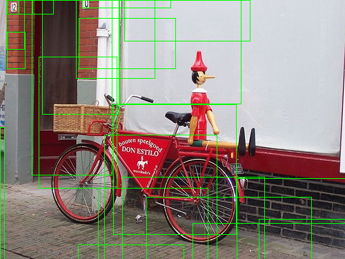
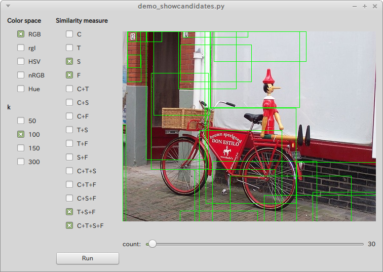
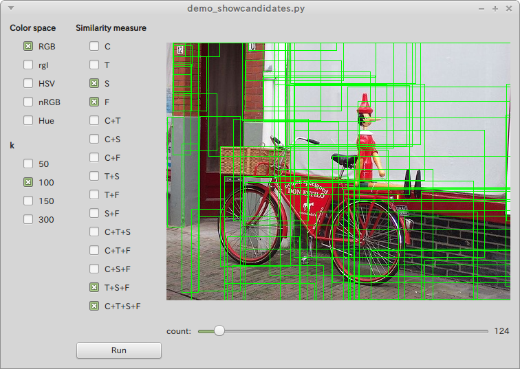
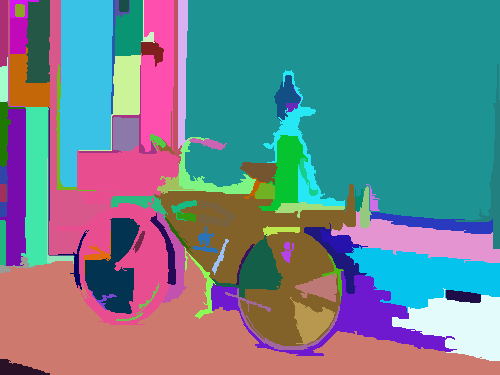
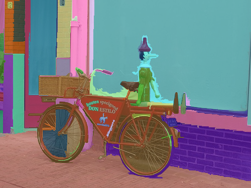

# Overview

This is a python implementation of the Selective Search [[1]](#selective_search_ijcv)[[2]](#selective_search_iccv).

The Selective Search is used as a preprocess of object detection/recognition pipeline.<br/>
It finds regions likely to contain any objects from an input image regardless of its scale and location,
that allows detectors to concentrate only for such 'prospective' regions.<br/>
Therefore you can configure more computationally efficient detector,
or use more rich feature representation and classification method [[3]](#deeplearning)
compared to the conventional exhaustive search scheme.

For more details about the method, please refer the original paper.

This implementation is based on the journal edition of the original paper, and giving similar parameter variations.




# Requirements

* CMake (>= 2.8)
* GCC (>= 4.8.2)
* Python (>= 3.4.3)
    * numpy (>= 1.9.2)
    * scikit-image (>= 0.11.3)
    * PySide (>= 1.2.2)
    * pytest (>= 2.7.0)
* Boost (>= 1.58.0) built with python support
* [Boost.NumPy](https://github.com/ndarray/Boost.NumPy)
    * If you got an error to build, see [belltailjp/Boost.NumPy](https://github.com/belltailjp/Boost.NumPy))

In addition, this is only tested on x64 Linux environment.


# Preparation

This implementation contains a few C++ code which wraps the Efficient Graph-Based Image Segmentation [[4]](#segmentation) used for generating an initial value.
It works as a python module, so build it first.

```sh
% git clone https://github.com/belltailjp/selective_search_py.git
% cd selective_search_py
% wget http://cs.brown.edu/~pff/segment/segment.zip; unzip segment.zip; rm segment.zip
% cmake .
% make
```

Then you will see a shared object `segment.so` in the directory.
Keep it on the same directory of main Python script, or referrable location described in `LD_LIBRARY_PATH`.


# Demo

## Interactively show regions likely to contain objects

*showcandidate* demo allows you to interactively see the result of selective search.

```sh
% ./demo_showcandidates.py image.jpg
```



You can choose any combination of parameters on the left side of the screen.
Then click the "Run" button and wait for a while. You will see the generated regions on the right side.

By changing the slider on the bottom, you can increase/decrease number of region candidates.
The more slider goes to left, the more confident regions are shown like this:




## Show image segmentation hierarchy

*showhierarchy* demo visualizes colored region images for each step in iteration.

```sh
% ./demo_showhierarchy.py image.jpg --k 500 --feature color texture --color rgb
```



If you want to see labels composited with the input image, give a particular alpha-value.

```sh
% ./demo_showhierarchy.py image.jpg --k 500 --feature color texture --color rgb --alpha 0.6
```




# Implementation

## Overview

Algorithm of the method is described in Journal edition of the original paper in detail ([[1]](#selective_search_ijcv)).
For diversification strategy, this implementation supports to vary the following parameter as the original paper proposed.

* Color space
    * *RGB, Lab, rgI, HSV, normalized RGB* and *Hue*
    * *C* of Color invariance [[5]](#color_invariance) is currently not supported.
* Similarity measure
    * Texture, Color, Fill and Size
* Initial segmentation parameter *k*
    * As the initial (fine-grained) segmentation, this implementation uses [[4]](#segmentation). *k* is one of the parameters of the method.

You can give any combinations for each strategy.


## How to integrate to your code

If you just want to use this implementation as a black box, only the `selective_search` module is necessary to import.

```python
from selective_search import *

img = skimage.io.imread('image.png')
regions = selective_search(img)
for v, (i0, j0, i1, j1) in regions:
    ...
```

Then you can get a list regions sorted by score in ascending order.
Regions with larger score (latter elements of the list) are considered as 'non-prospective' regions, so they can be filtered out as you need.

To change parameters, just give a list of values for each diversification strategy. Note that they must be given as a list.
`selective_search` returns a single list of generated regions which contains every combination of selective search result.
This result is also sorted.

```python
regions = selective_search(img, \
                           color_spaces = ['rgb', 'hsv'],\  #color space. should be lower case.
                           ks = [50, 150, 300],\            #k.
                           feature_masks = [(0, 0, 1, 1)])  #indicates whether S/C/T/F similarity is used, respectively.
```


## Test

This implementation contains automated unit tests using PyTest.

To execute full test, type:

```sh
% py.test
```


# References

\[1\] <a name="selective_search_ijcv"> [J. R. R. Uijlings et al., Selective Search for Object Recognition, IJCV, 2013](https://ivi.fnwi.uva.nl/isis/publications/bibtexbrowser.php?key=UijlingsIJCV2013&bib=all.bib) <br/>
\[2\] <a name="selective_search_iccv"> [Koen van de Sande et al., Segmentation As Selective Search for Object Recognition, ICCV, 2011](https://ivi.fnwi.uva.nl/isis/publications/bibtexbrowser.php?key=UijlingsIJCV2013&bib=all.bib) <br/>
\[3\] <a name="deeplearning"> [R. Girshick et al., Rich Feature Hierarchies for Accurate Object Detection and Semantic Segmentation, CVPR, 2014](http://www.cs.berkeley.edu/~rbg/papers/r-cnn-cvpr.pdf) <br/>
\[4\] <a name="segmentation"> [P. Felzenszwalb et al., Efficient Graph-Based Image Segmentation, IJCV, 2004](http://cs.brown.edu/~pff/segment/) <br/>
\[5\] <a name="color_invariance"> J. M. Geusebroek et al., Color invariance, TPAMI, 2001
